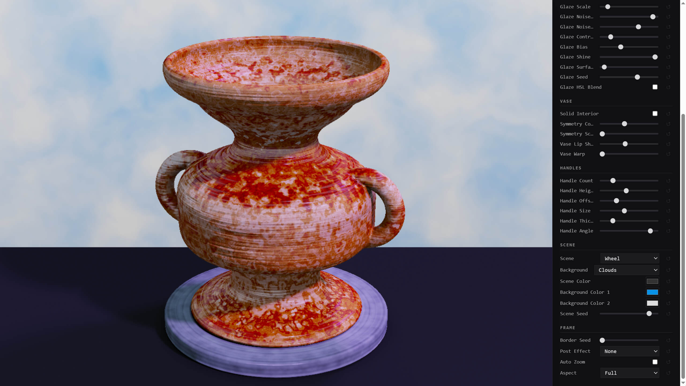

# VaseFX

VaseFX is a browser-based vase sculpting tool by Frank Force.

Sculpt, glaze, and render procedural pottery directly in your browser.

# [Live Demo](killedbyapixel.github.io/VaseFX/)

## How To Use

- Open the app in your browser.
- Sculpt with mouse or touch.
- Export your image when you are happy with the result.

## Controls

- Mouse or touch: control view
- 1: save image
- 2: toggle free cam
- 3: toggle frame
- 4: toggle edit mode
- 5: toggle animate

Minting/sculpting controls from the source:

- Mouse click: sculpt
- Drag bottom: rotate
- Mouse wheel: tilt camera
- X / Z: undo / redo
- Ctrl: tight sculpt
- Shift: soft sculpt
- WASD: control view
- Space: stop spin
- R: reset
- G: generate random

## License

This project is licensed under the GNU General Public License v3.0 or later.

- Full text: see LICENSE
- SPDX identifier: GPL-3.0-or-later

## Notes

- Third-party notices are listed in `THIRD_PARTY_NOTICES.md`.
